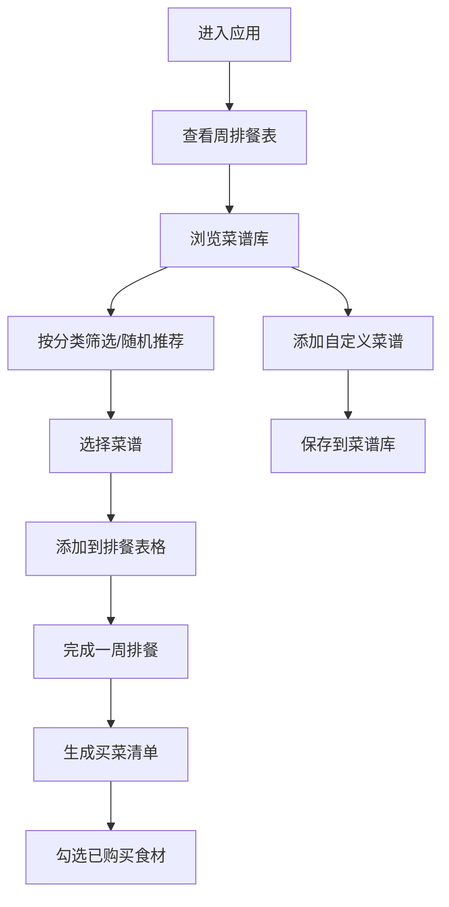

# "回家吃饭"家庭一周菜单规划 - 产品需求文档

## 1. 产品概述
"回家吃饭"是一款温馨的家庭菜单规划网页应用，帮助家庭成员轻松规划一周三餐，自动汇总生成买菜清单。
- 目标用户：需要安排家庭饮食的家庭主妇/主夫、上班族等
- 核心价值：简化排餐流程，减少买菜遗漏，让家常菜更有条理

## 2. 核心功能

### 2.1 用户角色
| 角色 | 注册方式 | 核心权限 |
|------|----------|----------|
| 家庭用户 | 无需注册，浏览器本地存储 | 管理菜谱库、排餐、查看买菜清单 |

### 2.2 功能模块
1. **菜谱库管理**：内置家常菜、添加自定义菜谱、按分类筛选、随机推荐
2. **一周排餐表**：7天×3餐的表格布局、拖拽/点击添加菜谱、查看详情、删除
3. **买菜清单**：自动汇总食材、合并用量、可勾选已购买

### 2.3 页面详情
| 页面名称 | 模块名称 | 功能描述 |
|----------|----------|----------|
| 排餐主页 | 顶部导航 | 品牌Logo、页面切换Tabs、随机推荐按钮 |
| 排餐主页 | 周视图表格 | 七天×三餐网格、显示已排菜谱、点击添加/删除 |
| 菜谱库页面 | 筛选栏 | 按餐次分类（早/午/晚）、按荤素分类（荤/素/汤） |
| 菜谱库页面 | 菜谱卡片 | 展示菜名、分类标签、食材概要、查看详情 |
| 菜谱库页面 | 添加菜谱 | 表单录入：名字、分类、食材清单（名称+用量）、做法步骤 |
| 买菜清单页面 | 汇总列表 | 按食材分类、显示总用量、勾选已购买、重置勾选 |

## 3. 核心流程

主要用户流程：
1. 用户进入应用 → 查看本周排餐表
2. 在菜谱库浏览或筛选菜谱 → 点击/拖拽添加到对应日期餐次
3. 排好一周菜单 → 切换到买菜清单页面
4. 系统自动汇总所有食材用量 → 用户购物时勾选已购买项
5. 可添加自定义菜谱丰富菜谱库

## 4. 用户界面设计

### 4.1 设计风格
- **主色调**：温暖的橙红色系（#E07856），搭配米白色背景（#FDF8F3）
- **辅助色**：柔绿色（#7BA05B）代表健康素食，暖棕色（#8B6F47）代表汤品
- **按钮风格**：圆润圆角（12px）、柔和阴影、悬停微放大效果
- **字体**：标题用具有手写感的中文字体，正文清晰易读的无衬线字体
- **布局风格**：卡片式布局、大量留白、温馨手绘风格图标
- **Icon风格**：使用emoji或线性图标增强亲切感（🍳🥬🍲🥕）

### 4.2 页面设计概述
| 页面名称 | 模块名称 | UI元素 |
|----------|----------|--------|
| 排餐主页 | 周视图表格 | 卡片式单元格、菜谱名+emoji、hover高亮、日期表头 |
| 菜谱库页面 | 菜谱卡片网格 | 图片占位+菜名、分类标签色块、食材数量显示 |
| 菜谱库页面 | 添加表单弹窗 | 分组输入框、食材动态增减行、做法多行文本 |
| 买菜清单页面 | 食材列表 | 勾选框、食材名称、合并用量、已购划线效果 |

### 4.3 响应式
- Desktop优先设计，移动端自适应
- 排餐表格在移动端改为竖向卡片流（每天一个卡片，内含三餐）
- 菜谱卡片在移动端1列，平板2列，桌面3-4列
- 所有按钮触控区域≥44px
