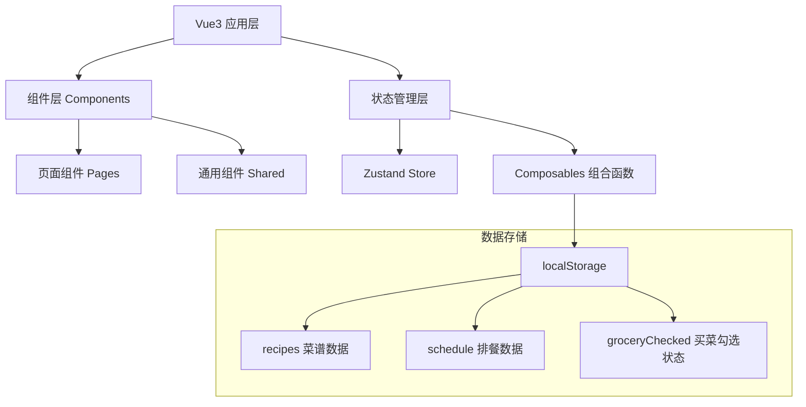
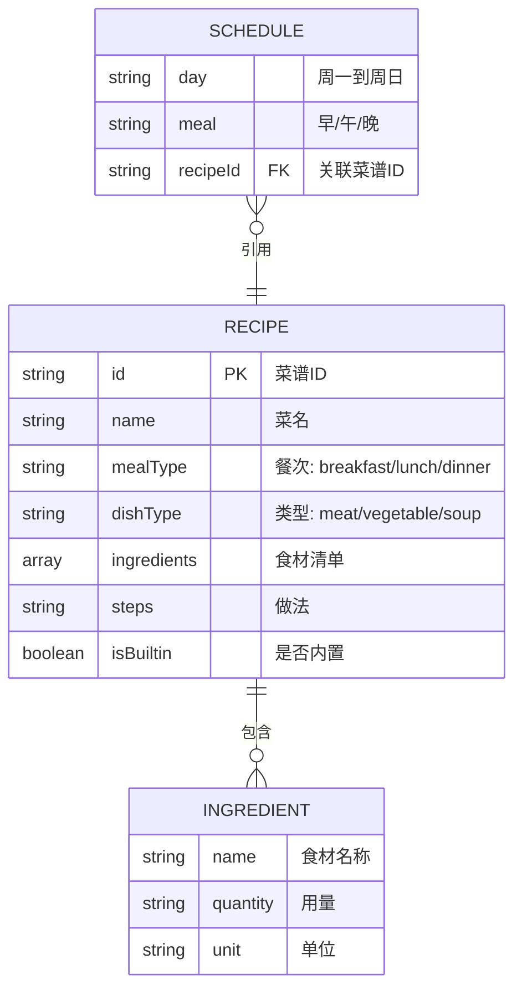

# "回家吃饭"家庭一周菜单规划 - 技术架构文档

## 1. 架构设计



## 2. 技术描述
- **前端框架**：Vue3 + TypeScript + Vite
- **CSS框架**：Tailwind CSS 3
- **状态管理**：Zustand（轻量级，适合纯前端项目）
- **路由**：Vue Router（Tab切换，可用也可不用，根据复杂度）
- **数据持久化**：浏览器 localStorage
- **图标**：lucide-vue-next + emoji
- **无后端、无数据库**，纯前端单页应用

## 3. 数据模型

### 3.1 数据模型定义



### 3.2 TypeScript 类型定义

```typescript
type MealType = 'breakfast' | 'lunch' | 'dinner';
type DishType = 'meat' | 'vegetable' | 'soup';
type DayOfWeek = 'monday' | 'tuesday' | 'wednesday' | 'thursday' | 'friday' | 'saturday' | 'sunday';

interface Ingredient {
  name: string;
  quantity: number;
  unit: string;
}

interface Recipe {
  id: string;
  name: string;
  mealTypes: MealType[];
  dishType: DishType;
  ingredients: Ingredient[];
  steps: string;
  isBuiltin: boolean;
  createdAt: number;
}

type ScheduleCell = Recipe | null;

interface WeeklySchedule {
  [day: DayOfWeek]: {
    breakfast: ScheduleCell;
    lunch: ScheduleCell;
    dinner: ScheduleCell;
  };
}

interface GroceryItem {
  name: string;
  totalQuantity: number;
  unit: string;
  checked: boolean;
  usedIn: string[];
}
```

## 4. 项目结构

```
xm9/
├── src/
│   ├── components/          # 通用组件
│   │   ├── RecipeCard.vue       # 菜谱卡片
│   │   ├── RecipeForm.vue       # 添加菜谱表单
│   │   ├── ScheduleCell.vue     # 排餐单元格
│   │   ├── GroceryItem.vue      # 买菜清单项
│   │   └── NavTabs.vue          # 导航Tab
│   ├── composables/         # 组合函数
│   │   ├── useLocalStorage.ts   # 本地存储
│   │   └── useGroceryList.ts    # 买菜清单逻辑
│   ├── data/                # 静态数据
│   │   └── builtinRecipes.ts    # 内置家常菜
│   ├── store/               # 状态管理
│   │   └── index.ts             # Zustand store
│   ├── types/               # 类型定义
│   │   └── index.ts
│   ├── utils/               # 工具函数
│   │   └── helpers.ts
│   ├── views/               # 页面视图
│   │   ├── ScheduleView.vue     # 排餐主页
│   │   ├── RecipesView.vue      # 菜谱库
│   │   └── GroceryView.vue      # 买菜清单
│   ├── App.vue
│   ├── main.ts
│   └── index.css
├── index.html
├── vite.config.ts
├── tsconfig.json
├── tailwind.config.js
└── package.json
```

## 5. 关键实现思路

### 5.1 localStorage 持久化
- Zustand store 订阅变化自动写入 localStorage
- 应用启动时从 localStorage 读取初始化，如无数据则使用内置菜谱种子数据
- 三个独立的 key：`hfc_recipes` / `hfc_schedule` / `hfc_grocery_checked`

### 5.2 买菜清单算法
```
遍历一周排餐的所有格子 → 
  对每道菜谱遍历其食材 → 
    按「食材名+单位」分组累加数量 → 
  输出已排序的食材清单数组
```

### 5.3 排餐添加交互
- 方式1：点击排餐单元格 → 弹出菜谱选择器 → 选中后填入
- 方式2（可选增强）：HTML5 拖拽 API，从菜谱库拖到单元格

### 5.4 随机推荐算法
- 根据筛选条件（可选）从菜谱库随机选一道
- 防重复：与上一次推荐不同
